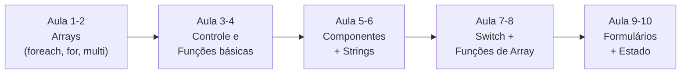

# IntermediatePHP 🇧🇷

**Documentação completa de estudo — Curso Intermediate PHP**

Este repositório reúne **10 aulas** de PHP intermediário, organizadas por pasta (uma aula por pasta). O objetivo é documentar tudo o que foi aprendido de forma detalhada, para facilitar a revisão e consulta futura.

> **Público-alvo:** quem já conhece PHP básico e quer dominar arrays, funções, controle de fluxo, organização de código e manipulação de dados do usuário (GET/POST, Sessões e Cookies).

---

## 📂 Estrutura do projeto

```
IntermediatePHP/
├── README.md                     ← Você está aqui
├── Class01_ForeachEForParaArrays/
│   └── index.php
├── Class02_ArrayMultidimensional/
│   └── index.php
├── Class03_DieESleep/
│   └── index.php
├── Class04_Funcao/
│   └── index.php
├── Class05_IncludeEDate/
│   ├── index.php
│   ├── header.php
│   └── footer.php
├── Class06_FuncaoParaString/
│   ├── index.php
│   └── html/
│       ├── header.php
│       ├── section.php
│       └── footer.php
├── Class07_SwitchContinueBreak/
│   └── index.php
├── Class08_FuncaoParaArrays/
│   ├── index.php
│   └── htmlParticles/
│       ├── header.php
│       ├── main.php
│       └── footer.php
├── Class09_FormularioGETPOST/
│   └── index.php
└── Class10_SessoesECookies/
    ├── index.php
    └── index2.php
```

**Como rodar localmente:** cada aula fica num subdiretório dentro de `ClassXX_...`. No navegador, acesse o arquivo `index.php` de cada pasta, por exemplo:

```
http://localhost/IntermediatePHP/Class01_ForeachEForParaArrays/index.php
```

> **Requerimentos:** PHP 7+ rodando no XAMPP (ou outro servidor local).

---

## 🗺️ Mapa do aprendizado (progressão)



---

## 📚 Aula por Aula

---

### Class 01 — Foreach e For para Arrays

**Arquivo:** `Class01_ForeachEForParaArrays/index.php`

Aula introdutória sobre como percorrer elementos de um array no PHP usando dois laços principais: `foreach` e `for`.

#### Conceito 1: `foreach` com chave e valor

O `foreach` é a forma mais direta de percorrer um array. Ele retorna **simultaneamente** a chave (índice) e o valor de cada elemento:

```php
$arr = array('A','B','C','D','E','F','G');
$extenso = array('Primeira', 'Segunda', 'Terceira', 'Quarta', 'Quinta', 'Sexta', 'Sétima');

foreach ($arr as $key => $value) {
    echo $key . ' => ' . $extenso[$key] . ' - ' . $value . '<br>';
}
```

- `$key` → o índice (0, 1, 2, ...)
- `$value` → o conteúdo do array naquela posição
- `count($arr)` → retorna o total de elementos

#### Conceito 2: Controle especial por chave

É possível fazer lógica diferente para o primeiro e último elemento usando a `$key`:

```php
foreach ($arr as $key => $value) {
    if ($key == 0) {
        echo "Início da lista: $value<br>";
    } elseif ($key == count($arr) - 1) {
        echo "Fim da lista: $value<br>";
    }
}
```

#### Conceito 3: Identificar posição par/ímpar

```php
foreach ($arr as $key => $value) {
    if ($key % 2 == 0) {
        echo "Chave $key: Valor $value (Sou PAR!)<br>";
    } else {
        echo "Chave $key: Valor $value (Sou ÍMPAR!)<br>";
    }
}
```

#### Conceito 4: `for` tradicional

Quando você precisa do controle total do índice:

```php
$total = count($arr);
for ($i = 0; $i < $total; $i++) {
    echo $arr[$i] . ' ';
}
```

**Quando usar cada um:**

| Laço | Melhor quando... |
|------|------------------|
| `foreach` | Você quer percorrer **todos** os elementos de forma simples |
| `foreach ($key => $value)` | Precisa saber a **posição** de cada elemento |
| `for` | Precisa controlar manualmente o índice ou contar de trás para frente |

---

### Class 02 — Array Multidimensional

**Arquivo:** `Class02_ArrayMultidimensional/index.php`

Conceito fundamental: um **array que contém outros arrays** dentro dele, criando estruturas de múltiplos níveis (linhas e colunas).

#### Array simples vs. Multidimensional

```php
// Array simples (1 nível)
$arr1 = array('A', 'B', 'C', 'D');
echo $arr1[0]; // A

// Array multidimensional (2 níveis)
$arr2 = array(
    array('A'),
    array('B'),
    array('C'),
    array('D'),
);
echo $arr2[0][0]; // A
echo $arr2[1][0]; // B
echo $arr2[2][0]; // C
```

- `$arr1[0]` → um índice
- `$arr2[0][0]` → **dois índices**: primeiro para o array interno, segundo para o elemento dentro dele

#### Aplicação prática

Arrays multidimensionals são a base para representar:
- Tabelas de dados (linhas × colunas)
- Listas de produtos com propriedades (nome, preço, estoque)
- Dados vindos de bancos de dados

---

### Class 03 — Die e Sleep

**Arquivo:** `Class03_DieESleep/index.php`

Aula sobre controle de execução do servidor — quando pausar e quando abortar.

#### `sleep()` — Pausa temporária

```php
sleep(5);          // Espera 5 segundos antes de continuar
echo 'o servidor acordou';
```

**Uso:** atrasar execução intencionalmente (ex.: esperar resposta de API, simular processamento).

#### `die()` — Encerra o script

```php
$name = array(array('A'), array('B'));

if ($name[1][0] == 'A') {
    echo 'Certinho';
} elseif ($name[1][0] == 'B') {
    die('o script morreu');   // Tudo depois disso NÃO será executado
}

echo 'teste';   // Só aparece se o die() não for chamado
```

> ⚠️ **Atenção:** `die()` imprime uma mensagem e **para imediatamente** a execução do PHP. Tudo que vem depois simplesmente não roda.

**Quando usar:**
- Validar falhas fatais (ex.: arquivo não encontrado, banco indisponível)
- Encerrar script quando uma condição crítica não é atendida

---

### Class 04 — Funções (Funções Básicas)

**Arquivo:** `Class04_Funcao/index.php`

Introdução ao conceito de **funções** — blocos de código reutilizáveis.

#### Anatomia de uma função

```php
// 1. O estoque (o array)
$names = array('A', 'B', 'C');

// 2. O manual de instruções (a função)
function mostrarNome(string $nomeDaVez) {
    // Type hinting: o parâmetro PRECISA ser uma string
    echo '<span style="color:white">My name is ' . $nomeDaVez . '</span><hr>';
}

// 3. O motor (o loop)
for ($i = 0; $i < count($names); $i++) {
    // 4. O chamado (executar a função)
    mostrarNome($names[$i]);
}
```

#### Analogia usada na aula

| Parte | Analogia |
|-------|----------|
| `$names = [...]` | O estoque — dados guardados |
| `function mostrarNome()` | O manual — a receita do que fazer |
| `for` loop | O motor — repete a ação |
| `mostrarNome(...)` | O chamado — executa a receita |

#### Conceitos-chave

- **Type hinting** (`string $param`): obriga o PHP a validar que o tipo recebido é o correto
- Uma função só é executada **quando chamada**
- Parâmetros são valores passados para dentro da função

---

### Class 05 — Include e Date

**Arquivo:** `Class05_IncludeEDate/index.php` + `header.php` + `footer.php`

Aula sobre **componentização de código** (reutilizar pedaços de HTML) e manipulação de **datas**.

#### Include, Require e suas variantes

```php
$tittle_site = 'My site';
include 'header.php';   // Insere o conteúdo do header.php
// ... conteúdo da página ...
include 'footer.php';   // Insere o conteúdo do footer.php
```

> **Dica:** quando o PHP executa `include`, as variáveis do arquivo principal ficam disponíveis dentro do arquivo incluido (por isso `$tittle_site` aparece no `header.php`).

| Comando | Se o arquivo NÃO existir | Se já foi incluido |
|---------|--------------------------|--------------------|
| `include` | **Aviso** (warning), continua | Include de novo |
| `require` | **Erro fatal**, para tudo | Include de novo |
| `include_once` | Aviso, continua | **Só inclui uma vez** |
| `require_once` | Erro fatal, para tudo | **Só inclui uma vez** |

> ⚠️ **Correção:** nos comentários do código original, `include_once` e `require_once` estavam descritos como "dão aviso". Na verdade, o diferencial deles é **evitar inclusão duplicada** — incluem apenas **uma vez**, mesmo que o comando seja chamado várias vezes.

#### Datas no PHP

```php
date_default_timezone_set('America/Sao_Paulo');
$date = date('d/m/y H:i');
echo 'Hoje é ' . $date;
```

- `date_default_timezone_set()` — define o fuso horário
- `date('formato')` — formata a data/hora atual
- Ex.: `d/m/y H:i` → `27/08/26 14:30`

---

### Class 06 — Funções para Strings

**Arquivos:** `Class06_FuncaoParaString/index.php` + `html/section.php`

Aula com design bem estruturado (header + section + footer) sobre as principais funções para manipular **strings**.

#### `substr()` — Recortar uma string

```php
$cont = 'Lorem ipsum dolor sit amet, consectetur adipiscing elit...';
echo substr($cont, 0, 56);   // Pega 56 caracteres a partir da posição 0
```

> Parâmetros: `(string, posição_inicial, quantidade_de_caracteres)`

#### `explode()` — Divide string em array

```php
$name = 'Bernardo Pinciara Rodrigues';
$names = explode(' ', $name);   // Divide pelo espaço
// Resultado: array('Bernardo', 'Pinciara', 'Rodrigues')
```

#### `implode()` — Junta array em string

```php
$nameString = implode(' ', $names);
echo $nameString;   // "Bernardo Pinciara Rodrigues"
```

> `explode()` e `implode()` são **inversos** um do outro.

#### `strip_tags()` — Remove tags HTML/PHP

```php
$text = '<p>Este é um <strong>texto</strong> com <a href="#">links</a>.</p>';
echo strip_tags($text);   // "Este é um texto com links."
```

> **Uso em segurança:** remove HTML de dados inseridos pelo usuário para prevenir XSS.

#### `range()` — Gera array automático

```php
$letters = range('a', 'j');   // array('a','b','c',...'j')
$letters = range('a', 'z');   // array('a','b','c',...'z')
```

#### `echo` vs `print_r()`

```php
$letters = range('a', 'j');
print_r($letters);   // Mostra a estrutura do array (útil para debug)

for ($i = 0; $i < count($letters); $i++) {
    echo $letters[$i] . ' ';   // Imprime cada elemento formatado
}
```

- `echo` → imprime **exatamente** o que você passar (string)
- `print_r()` → imprime a **estrutura completa** (útil para arrays e objetos)

---

### Class 07 — Switch, Continue e Break

**Arquivo:** `Class07_SwitchContinueBreak/index.php`

Aula sobre estruturas de decisão alternativa e controle de loops.

#### `switch` — Múltiplas condições

```php
$letters = 'A';

switch ($letters) {
    case "A":
        echo "The letter is A";
        echo '<hr>';
        break;
}
```

**Regras do `switch`:**
- `switch($var)` testa a variável contra cada `case`
- Quando um `case` bate, executa o bloco até encontrar `break`
- ⚠️ **Sem `break`, o PHP "cai" (fallthrough) no próximo case!**
- `switch` **não aceita arrays**

#### `break` — Interrompe o loop

```php
for ($i = 0; $i < 20; $i++) {
    echo $i;
    echo "<hr>";
    if ($i == 10) {
        break;   // Para o loop no 10, ignora o restante
    }
}
```

#### `continue` (visto por alto)

Enquanto o `break` **interrompe** o loop inteiro, o `continue` **salta** a iteração atual e vai para a próxima:

```php
for ($i = 0; $i < 20; $i++) {
    if ($i == 10) {
        continue;   // Pula o 10, mas continua rodando até o 19
    }
    echo $i;
}
```

> Na aula, o `continue` foi mencionado, mas o exemplo prático usado foi o `break`.

---

### Class 08 — Funções para Arrays

**Arquivos:** `Class08_FuncaoParaArrays/index.php` + `htmlParticles/`

Aula com estrutura de componentes (`header`, `main`, `footer`) focada em funções built-in para manipular arrays.

#### `array_merge()` — Une dois arrays

```php
$var1 = range('a', 'i');   // ['a','b',...'i']
$var2 = range('j', 't');   // ['j','k',...'t']
$result1 = array_merge($var1, $var2);
// Resultado: ['a','b',..., 'i','j',...,'t']
echo count($result1);   // 20
```

#### `array_intersect_key()` — Interseção de chaves

Retorna apenas os elementos que têm a **mesma chave** nos arrays comparados:

```php
$var1 = range('a', 'i');   // chaves: 0 a 8
$var2 = range('j', 't');   // chaves: 0 a 14

$result2 = array_intersect_key($var1, $var2);
// chaves de $var1 que também existem em $var2 → 0 a 8
// Resultado: ['a','b',...,'i']

$result3 = array_intersect_key($var2, $var1);
// chaves de $var2 que também existem em $var1 → 0 a 8
// Resultado: ['j','k',...,'t']
```

> ⚠️ A ordem dos parâmetros importa! `array_intersect_key(A, B)` retorna os **valores de A** que têm chaves em B.

---

### Class 09 — Formulário GET e POST

**Arquivo:** `Class09_FormularioGETPOST/index.php`

Aula sobre coleta de dados do usuário via formulário, incluindo exibição estilizada do código em tela.

#### Conceito: GET vs POST

| Aspecto | `$_GET` | `$_POST` |
|---------|---------|----------|
| Dados ficam | No **URL** (visíveis) | No **corpo** da requisição (ocultos) |
| Segurança | Menor (URL é visível e fica no histórico) | Maior (dados não aparecem na URL) |
| Método no `<form>` | Padrão (sem `method`) | `<form method="post">` |

#### Código GET

```html
<form>
    <input type="text" name="name" placeholder="Digite seu nome">
    <input type="text" name="email" placeholder="Digite seu email">
    <input type="text" name="phone" placeholder="Digite seu telefone">
    <button type="submit" name="action" value="enviar">Enviar</button>
</form>
```

```php
if (isset($_GET["action"])) {
    $name = $_GET["name"];
    $email = $_GET["email"];
    $phone = $_GET["phone"];

    echo "<h3>Olá, $name!</h3>";
    echo "<h3>Email: $email</h3>";
    echo "<h3>Telefone: $phone</h3>";
}
```

#### Código POST

```html
<form action="process.php" method="post">
    <input type="text" name="name" placeholder="Digite seu nome">
    <input type="text" name="email" placeholder="Digite seu email">
    <input type="text" name="phone" placeholder="Digite seu telefone">
    <button type="submit" name="action" value="enviar">Enviar</button>
</form>
```

```php
if (isset($_POST["action"])) {
    $name = $_POST["name"];
    $email = $_POST["email"];
    $phone = $_POST["phone"];

    echo "<h3>Olá, $name!</h3>";
    echo "<h3>Email: $email</h3>";
    echo "<h3>Telefone: $phone</h3>";
}
```

#### `isset()` — Verifica se variável existe

```php
if (isset($_GET["action"])) {
    // Só executa se o botão "action" foi enviado
}
```

#### Exibir código como texto — `htmlspecialchars()`

Para mostrar o código-fonte na tela sem que o navegador o interprete:

```php
$exemplo1 = '...código completo...';
echo '<pre>' . htmlspecialchars($exemplo1) . '</pre>';
```

- `<pre>` → preserva espaços e quebras de linha
- `htmlspecialchars()` → converte `<`, `>`, `&` em entidades HTML seguras

#### CSS Flexbox (usado na aula)

Para colocar as divs GET e POST lado a lado:

```css
.container-exemplos {
    display: flex;
    gap: 20px;
    align-items: stretch;
}

.container-exemplos > div {
    flex: 1;
}
```

> **Aula anterior:** a classe do container era `"container"` em vez de `"container-exemplos"`, por isso as divs ficavam empilhadas. Foi corrigido.

> ⚠️ **Ponto de atenção:** o formulário POST aponta para `action="process.php"`, mas esse arquivo **não existe** na pasta. Para que o POST funcione, crie um `process.php` na mesma pasta da `index.php`.

---

### Class 10 — Sessões e Cookies

**Arquivos:** `Class10_SessoesECookies/index.php` + `index2.php`

Aula sobre **estado** — manter dados ao longo de múltiplas requisições.

#### Conceito: Sessão vs Cookie

| Aspecto | Sessão | Cookie |
|---------|--------|--------|
| Onde ficam | No **servidor** | No **navegador** do usuário |
| Duração | Até **fechar o navegador** (padrão) | Até **expirar** (tempo configurável) |
| Funcionamento | ID da sessão guardado no cookie | Valor guardado diretamente |

#### Sessão — `$_SESSION`

```php
session_start();   // OBRIGATÓRIO: inicia ou retoma a sessão

// Gravar
$_SESSION['name'] = 'Bernardo';

// Ler
if (isset($_SESSION['name'])) {
    echo 'Olá, ' . $_SESSION['name'];
} else {
    echo "Olá, visitante";
}

// Limpar uma variável
unset($_SESSION['name']);

// Destruir TUDO da sessão
session_destroy();
```

**Regras:**
- `session_start()` deve ser chamado **antes** de qualquer saída HTML
- `isset()` verifica se a variável de sessão já existe
- `session_destroy()` apaga **todas** as variáveis de sessão

#### Cookie — `setcookie()`

```php
// Define um cookie que expira em 1 dia
setcookie('name', 'Bernardo', time() + 60 * 60 * 24, '/');

// Lê o cookie
echo $_COOKIE['name'];
```

**Parâmetros de `setcookie()`:**
1. `nome` — nome da variável
2. `valor` — valor a ser armazenado
3. `tempo` — tempo de expiração (timestamp Unix). `time() + segundos` define quantos segundos durará
4. `caminho` — caminho onde o cookie é válido (`/` = todo o site)

> ⚠️ **Para deletar um cookie:** envie um `setcookie()` com tempo no passado:
> ```php
> setcookie('name', '', time() - 3600, '/');
> ```

---

## 🧩 Padrões e boas práticas observadas

### Evolução da organização do código

Dá para ver claramente um amadurecimento progressivo:

| Fases | Aulas | Estilo |
|-------|-------|--------|
| **Código solto** | 1–4 | Tudo no `index.php`, exemplos desligados com `/* ... */` |
| **Componentização** | 5–6 | Uso de `include` para `header.php` / `footer.php` |
| **Estrutura modular** | 7–8 | `header` + `main`/`section` + `footer`, CSS consistente |
| **Aplicação prática** | 9–10 | Formulários reais, exibição de código, flexbox, estado |

### Padrão de componentização (repetido na aula 6 e 8)

```
index.php          ← define variáveis + inclui componentes
header.php         ← <html>, <head>, <body> abertura, CSS
main/section.php   ← conteúdo principal
footer.php         ← fechamento de tags
```

---

## 🔜 Próximos passos sugeridos

Baseado na progressão de estudo, os próximos tópicos mais naturais seriam:

1. **Validação e sanitização de dados**
   - `filter_input(INPUT_GET, 'name', FILTER_SANITIZE_SPECIAL_CHARS)`
   - Validação de email, numérico, tamanho mínimo

2. **Segurança**
   - Prevenção de XSS (sempre usar `htmlspecialchars()` nos outputs)
   - Prevenção de SQL Injection (prepared statements)

3. **CRUD com banco de dados**
   - MySQLi ou PDO para conectar e consultar MySQL
   - Operações: Criar, Ler, Atualizar, Deletar

4. **Autenticação e login**
   - Combinar sessão + cookies + hash de senha
   - `password_hash()` e `password_verify()`

---

## ⚠️ Notas e pontos de atenção

- **Class09:** o `action="process.php"` do formulário POST referencia um arquivo que **não existe** na pasta. Crie `process.php` para o POST funcionar.
- **Class05:** nos comentários do código, `include_once` e `require_once` estão descritos incorretamente como "dão aviso". O diferencial real deles é incluir **apenas uma vez** (evitam duplicação).
- **Class03:** `die()` é destrutivo — use apenas para erros fatais. Para mensagens de erro normais, considere `return` dentro de funções.
- **Sessões (Class10):** `session_start()` **precisa** ser chamado antes de qualquer `echo`, `print` ou HTML.

---

*Documentação criada para fins de estudo e revisão pessoal. Todas as aulas foram testadas localmente com XAMPP.*
